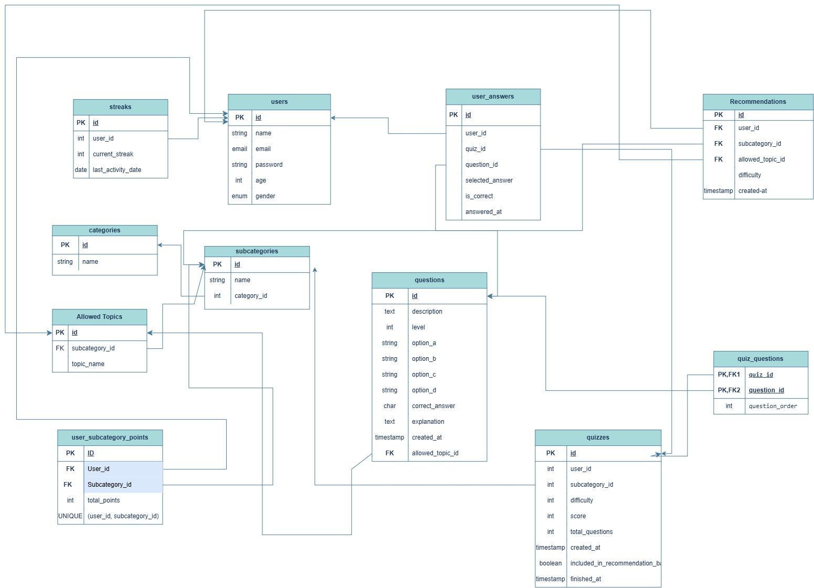

# Ma3refa Backend

<p align="center">
   
</p>


This is the API behind **Ma3refa (معرفة)** — the app that generates AI-powered quizzes on basically any topic, explains *why* your answer was wrong (not just that it was), and gets smarter about what to recommend you the more you use it.

This repo is the Laravel side of things. It handles users, auth, categories/topics, quizzes, scoring, streaks, and points. It doesn't generate questions itself — for that it talks to a separate AI microservice — but it owns everything else: storing the quiz, grading it, tracking your progress, and figuring out what you should study next.

## Stack

- **Laravel 13** on **PHP 8.3**
- **Sanctum** for API auth (token-based, no sessions/cookies for the mobile app)
- **MySQL** in production, but SQLite works fine for local dev (that's the default)
- Laravel's built-in **queue** (database driver) for background work — recommendations are computed async, not on the request
- **Docker** for deployment

## How it's organized

The important stuff:

- `app/Services/QuizService.php` — this is where the real logic lives. Generating a quiz, grading it, updating points/streaks. Controllers are kept thin on purpose.
- `app/Http/Controllers/QuizController.php` — generate / view / finish a quiz
- `app/Http/Controllers/Categories/` — browsing categories and subcategories
- `app/Jobs/ComputeRecommendationsJob.php` + `app/Listeners/CheckRecommendationBatch.php` — every time a user finishes their 5th quiz (since the last batch), this fires off a job that asks the recommendations service what the user should focus on next
- `app/Models/` — pretty standard Eloquent models, nothing fancy. `AllowedTopic` is the glue between subcategories and the actual questions/recommendations
- `routes/api.php` and `routes/auth.php` — all endpoints live here, everything (except auth itself) sits behind `auth:sanctum`

## The actual flow, in plain terms

1. User signs up / logs in → gets a Sanctum token.
2. They browse categories → subcategories (e.g. Programming → Python).
3. They hit "generate quiz." The backend first checks if there are unused cached questions sitting in the DB for that topic/difficulty. If there aren't enough, it calls out to the **AI Engine** service with the topic, difficulty, and how many questions it needs, gets back MCQs + explanations, and saves them (so they're cached for next time too).
4. User answers the quiz, submits it. We grade it server-side (never trust the client's claimed score), calculate points based on difficulty, bump their streak if they were active yesterday too, and save everything.
5. Every 5th finished quiz, we quietly ship the user's recent answer history off to the **Recommendations Engine**, which sends back what topics/difficulty they should try next. Those show up next time they load the categories screen (creating a personalized learning experience).
6. User can look back at any past quiz and see exactly what they got right/wrong with the explanation for each one.

That's basically it — two AI services doing the "smart" parts (generating questions, deciding what's next "DS jop"), and Laravel doing the boring-but-critical parts (auth, storage, grading, not letting people cheat, keeping the pieces connected).

## Endpoints

**Auth**
```
POST /api/register
POST /api/login
POST /api/logout
POST /api/forgot-password
POST /api/reset-password
GET  /api/verify-email/{id}/{hash}
POST /api/email/verification-notification
```

**Everything else** (needs a bearer token)
```
GET  /api/user/profile                                  → your stats, streak, points
GET  /api/categories                                    → categories + your current recommendations
GET  /api/categories/{category}/subcategories
GET  /api/user/subcategories/{subcategory}/quizzes       → your past quizzes in that topic
POST /api/quiz/generate                                  → 5/min, this hits the AI service
GET  /api/quiz/{quiz_id}                                 → full breakdown, answers + explanations
POST /api/quiz/{id}/finish                                → 10/min, submit + grade
```

## Database Design

The following ERD illustrates the database structure and the relationships between the main entities:

<p align="center">
   
</p>